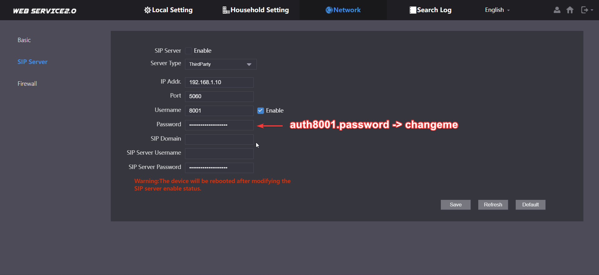
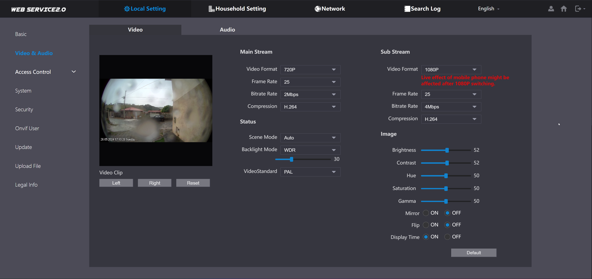

# Dahua VTO on Home Assistant

My personal Dahua VTO doorbell setup in Home Assistant, with no VTH or cloud dependency.

## Demos

### The card when the doorbell is ringing

https://github.com/user-attachments/assets/cef14806-f0c4-4c4b-a5e0-5cdcab07ff95

### The card when the doorbell is not ringing

https://github.com/user-attachments/assets/0cc0a9d8-984f-4946-a7a1-14fab96c9920

### The card in a tablet, combined with phone and TV notifications

The card on this demo is slighty outdated.

https://github.com/felipecrs/dahua-vto-on-home-assistant/assets/29582865/3aa5be77-995b-4858-91db-e60be104a70e

## Goals

- No cloud services (no Dahua app)
- No VTH (indoor station)
- No communication over SIP
- Use Home Assistant for notifications
- Use Home Assistant for 2-way audio communication (accepting the call, talking to the visitor)
- Use Frigate for object detection of the doorbell camera
- Use Frigate for recording of the doorbell camera

While my own setup is working fine, this guide is work in progress, but I plan to explain every bit of it (even if just to myself).

## Why not SIP?

I was using a fully SIP setup before, using Asterisk and the [SIP card](https://github.com/TECH7Fox/sip-hass-card). I decided to move away because:

1. Asterisk is too complicated to manage. I don't want to deal with it.
2. I could not find a nice way to make it beautiful in my dashboard. It always felt out of place.
3. Answering the doorbell when outside home would require to open UDP ports in my router, which I don't want to do.

## Caveats

The VTO needs a SIP number to call when someone rings it, and since I don't have a VTH, I'm using Asterisk fill that gap.

In this setup, Asterisk will also be used to trigger the automation in Home Assistant once someone rings the doorbell. You can use Dahua Integration's `binary_sensor.button_pressed` as well, but I found Asterisk to be both more reliable and more importantly: faster.

## Components

- Dahua VTO Doorbell [VTO2202F-P-S2](https://www.dahuasecurity.com/products/All-Products/Discontinued-Products/Video-Intercoms/VTO2202F-P-S2) (firmware V4.600.0000000.2.R.240802)
- Home Assistant (running through Home Assistant Operating System in this setup)
- [Dahua Home Assistant integration](https://github.com/rroller/dahua) to cancel the VTO call and to unlock the door
- [Asterisk add-on](https://github.com/TECH7Fox/asterisk-hass-addons) to receive the VTO call when someone rings it, and fire the Home Assistant automation
- [Frigate](https://github.com/blakeblackshear/frigate) for object detection and recording
- [go2rtc](https://github.com/AlexxIT/go2rtc) for 2-way audio communication, running inside Frigate in this example
- [Frigate Home Assistant integration](https://github.com/blakeblackshear/frigate-hass-integration), which allows the Advanced Camera Card to communicate with go2rtc within Frigate without needing external exposure of the go2rtc server
- [Advanced Camera Card](https://github.com/dermotduffy/advanced-camera-card) for 2-way audio communication within the Home Assistant dashboard
- [Fully Kiosk Browser](https://www.fully-kiosk.com/) on a tablet for the doorbell interface
- [Fully Kiosk Browser Home Assistant official integration](https://www.home-assistant.io/integrations/fully_kiosk/) to control the tablet from Home Assistant, like turning its screen on, navigating to the doorbell dashboard page, and ringing
- [layout-card](https://github.com/thomasloven/lovelace-layout-card/) to allow the doorbell dashboard to use full width of my tablet screen in vertical orientation, while still displaying other larger displays in horizontal orientation nicely
- [Home Assistant companion app](https://companion.home-assistant.io), to receive notifications when someone rings the doorbell
- [Notifications for Android TV Home Assistant integration](https://www.home-assistant.io/integrations/nfandroidtv/), to receive notifications on my TVs when someone rings the doorbell

## How to

This is not a step-by-step guide. This is just a reference for the specific configurations of each of the components above to make it work like in the demo.

### Configuring Asterisk

You need to [install the Asterisk add-on](https://github.com/TECH7Fox/asterisk-hass-addons/blob/main/asterisk/DOCS.md) and then add a PJSIP extension for the VTO. Also, you need a number/extension for the VTO to call to. The VTO connect to Asterisk and when someone rings it, it will call Asterisk using that number/extension.

When Asterisk receives the call, it will fire the Home Assistant automation. This is done through a script that calls Home Assistant's REST API to turn the `input_boolean.doorbell_calling` on, which then triggers the automation that handles the doorbell ring.

The relevant Asterisk files, including the script mentioned above, can be found at [`asterisk`](./asterisk/).

In my case, these files are added to `/addon_configs/b35499aa_asterisk/asterisk`. Don't forget to add execution permissions to the script with `chmod +x /addon_configs/b35499aa_asterisk/asterisk/perform_ha_action.sh`, otherwise Asterisk will not be able to execute it.

### Configuring the VTO

The VTO SIP server configuration should be as following:



Also, this is how I configure my video stream in the VTO:



It works well for me. I use the sub stream to record in Frigate.

### Configuring Frigate

I am using Frigate 0.16 Beta. Beyond that, nothing outside of the usual. You can check [Frigate 0.16 Beta docs](https://deploy-preview-16390--frigate-docs.netlify.app/).

The relevant section of my Frigate configuration file can be found [here](./frigate/config.yaml).

Make sure the [Frigate Home Assistant integration](https://docs.frigate.video/integrations/home-assistant) is also configured, it is needed for Advanced Camera Card.

> **Note**
> Support for making this work without Frigate is being tracked [here](https://github.com/dermotduffy/advanced-camera-card/issues/1984). It can already be done (Advanced Camera Card supports arbitrary go2rtc URLs), but you would need to protect and expose your go2rtc server to the world, which is not ideal.

### Configuring go2rtc

go2rtc runs inside Frigate 0.16 Beta in this setup. The go2rtc configuration is part of the Frigate configuration itself. The important thing here is to use the [`fix_vto_codecs.sh`](./frigate/fix_vto_codecs.sh) script to `echo` your VTO RTSP URLs.

In my case, I added such script to `/addon_configs/ccab4aaf_frigate-beta/fix_vto_codecs.sh`. Make sure it has execution permission with `chmod +x /addon_configs/ccab4aaf_frigate-beta/fix_vto_codecs.sh`, otherwise go2rtc will not be able to execute it.

Note the script provides a `--https` flag in case your VTO has HTTPS enabled. Mine doesn't.

### Configuring the Advanced Camera Card

The code for my dashboard with the Advanced Camera Card configured can be found [here](./home-assistant/dashboards/doorbell.yaml).

My dashboard is configured to use [layout-card](https://github.com/thomasloven/lovelace-layout-card/), but you are free to make it use other dashboard types.

### Configuring Fully Kiosk Browser

My [Fully Kiosk Browser](https://www.fully-kiosk.com) `settings.json` can be found [here](./fully-kiosk-browser/fully-settings.json). Do not forget to have the [Fully Kiosk Browser official Home Assistant integration](https://www.home-assistant.io/integrations/fully_kiosk) configured, since it is used in the automations.

### Configuring Home Assistant

Make sure to have the [Home Assistant Dahua integration](https://github.com/rroller/dahua) configured, which is used to cancel the VTO call and to unlock the door.

Then, pretty much everything is orchestrated through Home Assistant automations.

I left a reference of my automations [here](./home-assistant/automations/).

You can pick the ones you want, and then edit them to fit your needs.

The main one is [`doorbell-ringed.yaml`](./home-assistant/automations/doorbell-ringed.yaml), which starts when someone rings the doorbell and performs the necessary actions like you saw in the demo video.

Its first action is to cancel the call in the VTO. This is important so that 2-way audio communication can work well within go2rtc and the Advanced Camera Card.

You will need to [create two `input_boolean`s](https://www.home-assistant.io/integrations/input_boolean/) as well. In my automations they are named `input_boolean.doorbell_calling` (suggested icon is `mdi:phone`) and `input_boolean.do_not_disturb` (suggested icon is `mdi:bell-off`).

The integration also uses the [`ringtone.mp3`](./home-assistant/www/asterisk/ringtone.mp3) to emulate a call by playing it on the tablet. Make sure such file is in your `/config/www/asterisk/` folder.

I created notification groups for my mobile devices and for my TVs to simplify my automation. If you want to do the same, it's as simple as adding this to your Home Assistant `configuration.yaml`:

```yaml
notify:
  - name: all_phones
    platform: group
    services:
      - action: mobile_app_phone_a
      - action: mobile_app_phone_b
  - name: all_tvs
    platform: group
    services:
      - action: kitchen_tv
      - action: bedroom_tv
```
